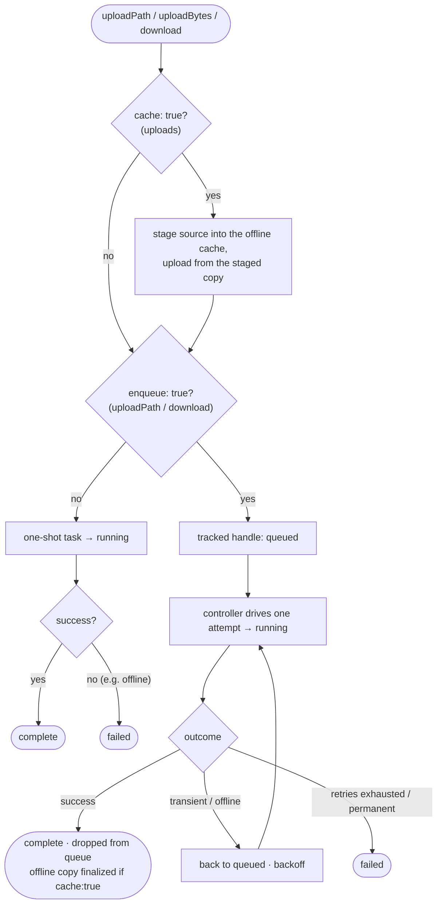

# winche_storage

Dart SDK for the WincheStorage file management backend. Provides resumable, multipart-aware upload and download tasks behind a reference-based API, with an optional durable **offline cache** and **auto-resume** layer.

## Features

- Reference-based `ChildReference` API (`storage.child('a/b/c.jpg')`).
- Resumable, multipart-aware uploads from a file path or raw bytes.
- Resumable downloads with HTTP `Range` support.
- Pause / resume / cancel on both upload and download tasks, with progress streams.
- **Offline cache:** keep files available offline — `cache: true` on upload (no
  download roundtrip) or `makeAvailableOffline()` after. Server reads
  (`getSnapshot`/`listChildren`) and cache reads (`offlineSnapshot`/
  `offlineChildren`) are separate; content-aware freshness via `offlineCopyStatus()`.
- **Durable transfers:** `enqueue: true` queues an upload/download so it survives
  an app restart and retries with backoff — start it while offline and just
  `await` it. Reattach a progress UI after a restart with `uploadFor`/`downloadFor`.
- Per-operation control: `enqueue` (durable) and `cache` (keep-offline) flags;
  transfers expose a `queued` state and resolve only on the terminal outcome.
- Pure Dart — no Flutter dependency. Persistence via [`sembast`](https://pub.dev/packages/sembast)
  (file on native, IndexedDB on web), or fully in-memory.
- Pluggable backend via the `WincheStorageApi` interface (`WincheStorageHttpApi` ships by default).
- Typed exceptions (`WincheStorageException` and subclasses).

## Installation

```bash
dart pub add winche_storage
```

Or add it to `pubspec.yaml`:

```yaml
dependencies:
  winche_storage: ^4.0.0
```

## Setup

`WincheStorage` is ready to use as soon as it's constructed — there is no
initialize step. The durable transfer queue and offline cache are enabled simply
by configuring a store (see the note under the example).

```dart
import 'package:winche_storage/winche_storage.dart';

final storage = WincheStorage(
  WincheStorageConfig(
    uri: Uri.parse('https://your-api.example.com/files'),

    // Optional. Returns the current auth token, re-read on every request, so a
    // rotated token is picked up automatically. Sent as `Authorization: Bearer`.
    tokenProvider: () async => currentToken,

    // Resolves the offline cache root and the sembast database directory.
    // Its presence (or `inMemory`, or web) enables the durable transfer queue
    // and offline cache — there are no separate enable flags.
    directoryResolver: () async {
      final dir = await getApplicationDocumentsDirectory(); // from path_provider
      return '${dir.path}/winche_files';
    },

    // Optional. Files larger than this are uploaded in parts. Defaults to 5 MiB.
    multipartThreshold: 5 * 1024 * 1024,

    // Optional. Use an in-memory index (catalog + transfer queue) instead of
    // sembast — files still go to disk. Handy for tests. Defaults to false.
    inMemory: false,

    // Optional. Backoff tuning for the durable transfer queue's retries.
    retryBaseDelay: Duration(seconds: 1),
    retryMaxDelay: Duration(seconds: 30),
    retryMaxAttempts: 5,
    retryPollInterval: Duration(seconds: 30),
  ),
);
```

> **Store presence enables the subsystems.** The durable transfer queue and
> offline cache exist whenever there's somewhere to put a store: a
> `directoryResolver` (native), `inMemory: true`, or web (IndexedDB). With none
> of those configured on native the SDK is fully stateless — basic upload/
> download still work (`download` takes an explicit path), and durable/offline
> operations throw `StateError` at call time.

Call `await storage.dispose()` when you're done to stop the retry timer and close
the local store.

## How a transfer flows

The two per-call flags (`cache`, `enqueue`) and the durable lifecycle at a glance:



A tracked (`enqueue: true`) handle survives an app restart: on construction the
controller rehydrates the queue and re-drives each transfer from `queued`. Its
`whenDone` resolves only at a terminal node (`complete` / `failed`), so you can
start a transfer offline and just `await` it.

## Usage

### References

`ChildReference` points to a file by its slash-separated path. References
compose via `.child()`.

```dart
final userRoot = storage.child('userFiles/user-123');
final photoRef = userRoot.child('photo.jpg');
// equivalent to storage.child('userFiles/user-123/photo.jpg')

photoRef.name;     // 'photo.jpg'  — last path segment
photoRef.path;     // 'userFiles/user-123/photo.jpg'
photoRef.parent;   // ChildReference('userFiles/user-123')
```

### Upload

Upload from a local file path with `uploadPath`, or from bytes with
`uploadBytes`.

```dart
final task = photoRef.uploadPath(
  '/local/path/photo.jpg',
  mimeType: 'image/jpeg',     // optional — inferred from the extension if omitted
  metadata: {'label': 'cover'},
);

// Or from bytes (mimeType is required, as it can't be inferred):
final task = photoRef.uploadBytes(
  bytes,
  'image/jpeg',
  metadata: {'label': 'cover'},
);

// Stream progress
task.stateStream.listen((UploadTaskState state) {
  print('${state.status} — ${(state.progress * 100).toStringAsFixed(1)}%');
});

final FileSnapshot? snapshot = await task.whenDone; // null if cancelled
```

Uploading to a path that already has a file:

- **Completed file, identical size + MIME** — skipped; the existing record is
  returned without re-uploading.
- **Completed file, different size or MIME** — replaced (the old object is
  deleted and the new content uploaded).
- **Interrupted upload, identical size + MIME** — resumed from the last
  completed part.
- **Interrupted upload, different size or MIME** — discarded and re-uploaded
  from scratch (so a previously failed attempt never blocks the path).

Files at or below `multipartThreshold` upload in a single request; larger files
are uploaded in parts.

#### Per-call flags: `enqueue` and `cache`

Two optional flags make an upload robust:

- **`enqueue: true`** — durable: the upload joins the transfer queue, is deduped
  by path, survives an app restart, and retries until it succeeds (so it can be
  started while offline). File-backed only (`uploadPath`); requires a configured
  store. Without it, the upload is a one-shot.
- **`cache: true`** — keep it available offline: the source is staged, uploaded
  from that staged copy, then moved into the id-keyed offline cache on success —
  no separate download. Best-effort (a caching failure leaves the upload
  successful and records a stale pin). Requires a configured offline cache.

```dart
// Durable AND offline-kept — start it even while offline; await it; it
// completes once the server is reachable.
final task = photoRef.uploadPath(
  '/local/path/photo.jpg',
  enqueue: true,
  cache: true,
);
await task.whenDone;
```

A flag whose subsystem isn't configured throws `StateError` (see
[Setup](#setup)). `uploadBytes` accepts `cache` (it stages the bytes to disk
first) but **not** `enqueue` — byte uploads aren't durable; write the bytes to a
file and use `uploadPath(enqueue: true)` for that. The `cache` upload is the
upload-time counterpart to [`makeAvailableOffline()`](#offline-cache): same
result, reusing the bytes you already have instead of downloading them back.

### Download

`download` writes the file's bytes to an explicit path. For a managed,
offline-cached copy that needs no path, use
[`makeAvailableOffline`](#offline-cache) instead.

```dart
final task = photoRef.download('/local/photos/photo.jpg');

task.stateStream.listen((DownloadTaskState state) {
  print('${state.status} — ${(state.progress * 100).toStringAsFixed(1)}%');
});

await task.whenDone;
```

Pass `enqueue: true` to make the download durable — it joins the transfer queue
and resumes after an app restart, retrying until it succeeds (requires a
configured store; throws `StateError` otherwise). Without it the download is a
one-shot.

### Pause / resume / cancel

Both `UploadTask` and `DownloadTask` support mid-flight control:

```dart
task.pause();
task.resume(); // resumes from the last completed part / byte offset

// Upload cancel — also deletes the remote file record
await task.cancel();

// Download cancel — deletes any partially written local file
task.cancel();
```

### Offline cache

Requires a configured store (see [Setup](#setup)). Pin a file to download it
into a managed, id-keyed cache directory and track it so it stays available
offline.

> If you're the one uploading the file, prefer `uploadPath(..., cache: true)`
> (see [Upload](#upload)) — it populates the cache from the bytes you already
> have, skipping the download this method would otherwise perform.

```dart
// Download + pin for offline use. Completes when the file is on disk.
await photoRef.makeAvailableOffline();

// On a directory path it pins every file directly under it (one level — the
// server lists a single level, so nested sub-directories aren't included):
await storage.child('userFiles/user-123').makeAvailableOffline();

// What changed about the pinned copy? (content overwrite vs deleted vs current)
switch (await photoRef.offlineCopyStatus()) {
  case OfflineCopyStatus.contentChanged:
    await photoRef.refreshOfflineCopy(); // bytes changed — re-download
  case OfflineCopyStatus.remoteDeleted:
    await photoRef.removeOfflineCopy();  // gone — drop the local copy
  case OfflineCopyStatus.upToDate:
  case OfflineCopyStatus.notPinned:
  case OfflineCopyStatus.unknown:        // offline / no fingerprint — leave as-is
    break;
}

// Drop the local copy and catalog entry.
await photoRef.removeOfflineCopy();

// Remove every pinned file.
await storage.clearOfflineCache();
```

Reads split cleanly into **server** and **cache** — each call has one source:

- `getSnapshot()` / `listChildren()` are **server-only**: they return the
  authoritative server record(s) and throw `StorageUnavailableException` when the
  server is unreachable. They never consult the cache, so their `fromCache` is
  always `false` and they don't carry `isCached` / `localPath`.
- `offlineSnapshot()` / `offlineChildren()` are **cache-only**: they read the
  local catalog without contacting the server (`fromCache == true`), so they keep
  working offline. Both require a configured store. `offlineSnapshot()` returns a
  missing snapshot when the file isn't pinned; `offlineChildren()` returns the
  pinned files directly under the path (a partial view, possibly empty).

```dart
// Server-only: authoritative, throws when offline.
final FileSnapshot snap = await photoRef.getSnapshot();
if (snap.exists) print('server size: ${snap.data!.sizeBytes}');

// Cache-only: the local copy, no network.
final FileSnapshot offline = await photoRef.offlineSnapshot();
if (offline.exists) {
  print('available offline at: ${offline.data!.localPath}'); // <cacheDir>/<id>.jpg
}
```

Compose them yourself for a remote-first-with-fallback read:

```dart
Future<FileSnapshot> read(ChildReference ref) async {
  try {
    return await ref.getSnapshot();      // server first
  } on StorageUnavailableException {
    return await ref.offlineSnapshot();  // fall back to the cached copy
  }
}
```

The directory counterpart — annotate a live listing with offline state by
cross-referencing the cache-only read:

```dart
final live = await userRoot.listChildren();     // full server listing (throws offline)
final cached = await userRoot.offlineChildren(); // pinned-only, works offline
final cachedPaths = {for (final f in cached.files) f.reference.path};
for (final snap in live.files) {
  final badge = cachedPaths.contains(snap.reference.path) ? '✓ offline' : '';
  print('${snap.reference.path} $badge');
}
```

> On a **cache-only** snapshot, `data.localPath` is the absolute path to the local
> copy and `data.isCached` is `true` when its content is downloaded. Server-only
> reads don't carry these — use the `offline*` reads or `offlineCopyStatus()`.

Cached files are stored at `<directoryResolver()>/<fileId><.ext>` — keyed by the
immutable file id (so they survive path/metadata changes), with an extension
derived from the name or MIME type. Pins are explicit and never auto-evicted.

### Auto-resume

Available when a store is configured (see [Setup](#setup)). Uploads and
downloads started with `enqueue: true` are persisted to a durable queue, resumed
when the SDK is constructed, and retried
on failure with exponential backoff (configurable via the `retry*` fields on
`WincheStorageConfig`).

```dart
// `enqueue: true` makes it durable — queued, resumed after a restart, retried.
final task = photoRef.download('/local/photos/photo.jpg', enqueue: true);

// On app start, the SDK auto-resumes pending transfers. You can also trigger
// drains explicitly (e.g. when connectivity returns):
await storage.resumeDownloads();
await storage.resumeUploads();

// Resume a single path's transfer.
await photoRef.resumeTransfer();

// Observe lifecycle events as the queue drains.
storage.transferEvents.listen((TransferEvent e) {
  print('${e.type} ${e.kind} ${e.path}'); // started | completed | failed | retrying
});
```

A durable (`enqueue: true`) transfer is **tracked** and deduped by path: calling
`uploadPath`/`download` again for the same path returns the existing handle
rather than starting a duplicate. After a restart the original handle object is
gone, so reattach a progress UI with `storage.uploadFor(path)` /
`downloadFor(path)`. Per-byte progress stays on the handle's `stateStream`, which
also reports the `queued` state while it waits to (re)start.

### List a directory

```dart
final DirectorySnapshot dir = await storage.child('userFiles/user-123').listChildren(
  mimeType: 'image/jpeg', // optional filter
);

for (final snapshot in dir.files) {
  print('${snapshot.reference.path} — ${snapshot.data?.sizeBytes} bytes');
}
```

`listChildren()` is server-only — it throws `StorageUnavailableException` when
offline. For the locally pinned files, use `offlineChildren()` (see
[Offline cache](#offline-cache)).

### Get file metadata

`getSnapshot()` always returns a `FileSnapshot`. Check `exists` to know whether the file
is present; `data` is null when it isn't. It's server-only (throws when offline);
for the cached copy use `offlineSnapshot()` — see the
[Offline cache](#offline-cache) section.

```dart
final FileSnapshot snapshot = await photoRef.getSnapshot();

if (snapshot.exists) {
  final data = snapshot.data!;
  print(data.id);
  print(data.path);
  print(data.directory);
  print(data.mimeType);
  print(data.sizeBytes);
  print(data.uploadStatus); // UploadStatus.pending | .complete | .failed
  print(data.metadata);
  print(data.version);
  print(data.createdAt);
  print(data.updatedAt);
}
```

### Update metadata

```dart
final FileSnapshot updated = await photoRef.updateMetadata({'label': 'hero'});
```

### Delete

```dart
final bool deleted = await photoRef.delete(); // false if the file didn't exist
```

## API reference

### `WincheStorageConfig`

| Field | Type | Default | Description |
| --- | --- | --- | --- |
| `uri` | `Uri` | required | Base URI of the WincheStorage REST backend |
| `tokenProvider` | `FutureOr<String> Function()?` | null | Returns the auth token, re-read per request and sent as `Authorization: Bearer` |
| `multipartThreshold` | `int` | `5 * 1024 * 1024` | File size (bytes) above which multipart upload is used |
| `inMemory` | `bool` | `false` | Use an in-memory index (catalog + queue) instead of sembast; files still go to disk. Also enables the subsystems |
| `directoryResolver` | `Future<String> Function()?` | null | Resolves the offline cache root + sembast directory (lazy, cached). **Its presence (or `inMemory`/web) enables the durable queue + offline cache** |
| `retryBaseDelay` | `Duration` | `1s` | Initial backoff before the first durable-transfer retry |
| `retryMaxDelay` | `Duration` | `30s` | Cap on the exponential backoff between retries |
| `retryMaxAttempts` | `int` | `5` | Retries before a transfer fails permanently |
| `retryPollInterval` | `Duration` | `30s` | Backstop poll interval that re-drives still-retryable failed transfers |

### `WincheStorage`

| Member | Description |
| --- | --- |
| `WincheStorage(config)` | Creates the SDK. Ready to use immediately; auto-resumes pending transfers when a store is configured. |
| `WincheStorage.withStore(api, store, {...})` | Advanced/testing: build over an explicit `WincheStorageApi` and `StorageLocalStore` (subsystems always available). |
| `child(path)` | Returns a `ChildReference` for the given path. |
| `resumeDownloads()` | Drains all queued downloads. Throws `StateError` when no store is configured. |
| `resumeUploads()` | Drains all queued uploads. Throws `StateError` when no store is configured. |
| `pendingTransfers({kind})` | Snapshot of the durable queue (pending/running/failed `TransferRecord`s), optionally filtered by `TransferKind`. Throws `StateError` when no store is configured. |
| `transferEvents` | `Stream<TransferEvent>` of queue lifecycle events. Throws `StateError` when no store is configured. |
| `uploadFor(path)` / `downloadFor(path)` | The live tracked transfer handle for `path` (or `null`), to reattach a progress UI after a restart. Throws `StateError` when no store is configured. |
| `clearOfflineCache()` | Evicts every pinned file. Throws `StateError` when no store is configured. |
| `dispose()` | Stops the retry timer and closes the local store. |

### `ChildReference`

| Member | Description |
| --- | --- |
| `path` | The file's slash-separated path string. |
| `name` | The last path segment (e.g. `photo.jpg`). |
| `parent` | The parent reference, or `null` at a single-segment path. |
| `child(path)` | Returns a new `ChildReference` at `this.path/path`. |
| `getSnapshot()` | Fetches metadata from the **server only**; throws `StorageUnavailableException` when offline. |
| `listChildren({mimeType})` | Lists files under this path from the **server only**, returning a `DirectorySnapshot` (its `.files` holds a `FileSnapshot` each); throws when offline. |
| `offlineSnapshot()` | The cached copy's metadata, read from the local catalog only (`fromCache: true`); missing snapshot when not pinned. Requires a store. |
| `offlineChildren({mimeType})` | The locally pinned files directly under this path, read from the local catalog only (`fromCache: true`, partial, may be empty). Requires a store. |
| `uploadPath(localPath, {mimeType, metadata, multipartThreshold, enqueue, cache})` | Starts an `UploadTask` from a local file. `enqueue: true` → durable/queued; `cache: true` → also kept offline (stage-first). Each requires its subsystem, else `StateError`. |
| `uploadBytes(bytes, mimeType, {metadata, multipartThreshold, cache})` | Starts an `UploadTask` from raw bytes. `cache: true` keeps it offline. Not durable — use `uploadPath(enqueue: true)` for that. |
| `download(saveTo, {enqueue})` | Starts a `DownloadTask` to the explicit path `saveTo`. `enqueue: true` → durable/queued (else one-shot). |
| `makeAvailableOffline()` | Pins + downloads the file for offline use; on a directory path, pins every file directly under it (one level). Requires a configured store. |
| `refreshOfflineCopy()` | Re-downloads the current remote version into the cache. Requires a configured store. |
| `offlineCopyStatus()` | `Future<OfflineCopyStatus>` — `upToDate` / `contentChanged` / `remoteDeleted` / `notPinned` / `unknown` (offline or no fingerprint). Requires a configured store. |
| `removeOfflineCopy()` | Removes the local copy + catalog entry. Requires a configured store. |
| `resumeTransfer()` | Resumes this path's queued/paused durable transfer. Requires a configured store. |
| `updateMetadata(metadata)` | Updates server-side metadata. Returns a `FileSnapshot`. If the file is pinned offline, its cached metadata is updated too (content fingerprint preserved). |
| `delete()` | Deletes the file. Returns `bool`. |

Offline / durable-transfer methods throw `StateError` when no store is
configured (no `directoryResolver`, no `inMemory`, on native).

### `UploadTask`

| Member | Type | Description |
| --- | --- | --- |
| `state` | `UploadTaskState` | Current synchronous snapshot of status + progress. |
| `stateStream` | `Stream<UploadTaskState>` | Broadcast stream of state changes. |
| `whenDone` | `Future<FileSnapshot?>` | Completes with the confirmed `FileSnapshot`, or `null` if cancelled. |
| `pause()` | — | Cancels the in-flight request; preserves uploaded parts. |
| `resume()` | — | Restarts from the last completed part. |
| `cancel()` | `Future<void>` | Cancels the upload and deletes the remote file record. |

`UploadTaskStatus`: `queued`, `running`, `paused`, `complete`, `failed`,
`cancelled`. A durable (`enqueue: true`) task starts `queued`; its `whenDone`
resolves only on the terminal outcome (success or permanent failure), surviving
offline retries.

### `DownloadTask`

| Member | Type | Description |
| --- | --- | --- |
| `state` | `DownloadTaskState` | Current synchronous snapshot of status + progress. |
| `stateStream` | `Stream<DownloadTaskState>` | Broadcast stream of state changes. |
| `whenDone` | `Future<void>` | Completes when the download finishes, or throws on failure. |
| `saveTo` | `String` | The absolute destination path the file is written to. |
| `pause()` | — | Cancels the in-flight request; the partial file is kept for resume. |
| `resume()` | — | Resumes from the byte offset already written (HTTP `Range` request). |
| `cancel()` | — | Cancels and deletes any partial local file. |

`DownloadTaskStatus`: `queued`, `running`, `paused`, `complete`, `failed`,
`cancelled` (same semantics as `UploadTaskStatus`).

### `FileSnapshot`

An immutable snapshot of a file's metadata at a point in time.

| Member | Type | Description |
| --- | --- | --- |
| `exists` | `bool` | Whether the file is present. |
| `data` | `FileData?` | The file record, or `null` when `exists` is false. |
| `fromCache` | `bool` | True when the snapshot came from a cache-only read (`offlineSnapshot()`); always false for the server-only `getSnapshot()`. |
| `reference` | `ChildReference` | The reference this snapshot belongs to (use `reference.path` for the full path). |
| `name` | `String` | The last path segment. |
| `timestamp` | `DateTime` | When the snapshot was taken. |

`FileData` fields: `id`, `directory`, `path`, `mimeType`, `sizeBytes`,
`uploadStatus`, `metadata`, `version`, `createdAt`, `updatedAt`, `contentHash`,
plus two client-side offline fields:

`contentHash` — the server's content fingerprint (object ETag), used by `offlineCopyStatus()`; null when the backend hasn't recorded one.

| Field | Type | Description |
| --- | --- | --- |
| `localPath` | `String?` | Absolute path to the local copy, when pinned/registered. |
| `isCached` | `bool` | True when the content is fully downloaded locally and ready for offline use. |

### `DirectorySnapshot`

An immutable snapshot of a directory listing, returned by `listChildren()`
(server) or `offlineChildren()` (cache).

| Member | Type | Description |
| --- | --- | --- |
| `files` | `List<FileSnapshot>` | One snapshot per child file (unmodifiable). |
| `fromCache` | `bool` | True when the listing came from `offlineChildren()` (a cache-only, partial, pinned-only view); false for the server-only `listChildren()`. |
| `reference` | `ChildReference` | The directory this snapshot lists. |
| `name` | `String` | The directory's last path segment. |
| `length` / `isEmpty` / `isNotEmpty` | — | Convenience over `files`. |
| `timestamp` | `DateTime` | When the snapshot was taken. |

### Offline / auto-resume types

| Type | Description |
| --- | --- |
| `TransferEvent` | `{type, kind, path, error}` emitted on `transferEvents`. |
| `TransferEventType` | `started`, `completed`, `failed`, `retrying`. |
| `TransferKind` | `upload`, `download`. |
| `TransferRecord` / `TransferStatus` | A persisted queue entry returned by `pendingTransfers` — `{seq, kind, path, status, attempt, lastError, …}`; status is `pending`, `running`, or `failed`. |
| `CatalogEntry` / `CatalogStatus` | A pinned file record (`downloading`, `ready`, `stale`). |
| `OfflineCopyStatus` | `notPinned`, `upToDate`, `contentChanged`, `remoteDeleted`, `unknown` — result of `offlineCopyStatus()`. |
| `StorageLocalStore` | Persistence interface; `MemoryStorageLocalStore` and `SembastStorageLocalStore` ship by default. |

### `WincheStorageException`

A sealed exception hierarchy thrown on API errors. Each carries a semantic
`status` (`StorageErrorStatus`), a `message`, optional `details`, and the
originating `statusCode`.

```dart
try {
  await photoRef.updateMetadata({'label': 'hero'});
} on StorageNotFoundException catch (e) {
  print('not found: ${e.message}');
} on WincheStorageException catch (e) {
  print('${e.statusCode}: ${e.message}');
}
```

Subclasses: `StorageNotFoundException`, `StoragePermissionDeniedException`,
`StorageUnauthenticatedException`, `StorageInvalidArgumentException`,
`StorageFailedPreconditionException`, `StorageDeadlineExceededException`,
`StorageUnavailableException`, `StorageCancelledException`,
`StorageInternalException`, `StorageUnknownException`.

## Dependencies

- [`dio`](https://pub.dev/packages/dio) — HTTP client used by `WincheStorageHttpApi`, `UploadTask`, and `DownloadTask`
- [`mime`](https://pub.dev/packages/mime) — MIME type inference from file extension in `ChildReference.uploadPath`
- [`path`](https://pub.dev/packages/path) — platform-correct path joining for the offline cache
- [`sembast`](https://pub.dev/packages/sembast) / [`sembast_web`](https://pub.dev/packages/sembast_web) — pure-Dart durable store for the offline catalog and transfer queue (native file / web IndexedDB)

## License

[MIT](LICENSE)
