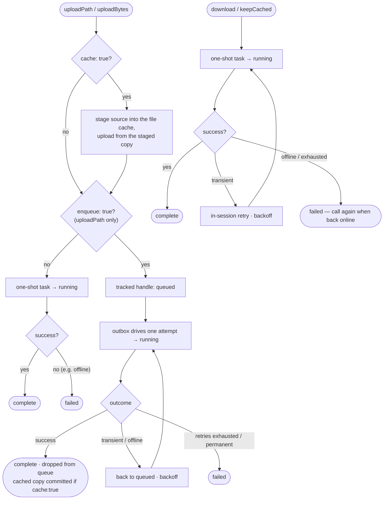

# winche_storage

Dart SDK for the WincheStorage file management backend. Provides resumable, multipart-aware upload and download tasks behind a reference-based API, with an optional **file cache** and a durable **upload outbox**.

## Features

- Reference-based `ChildReference` API (`storage.child('a/b/c.jpg')`).
- Resumable, multipart-aware uploads from a file path or raw bytes.
- Resumable downloads with HTTP `Range` support, guarded against server-side
  overwrites so a resumed download can never splice old and new content.
- Pause / resume / cancel on both upload and download tasks, with progress streams.
- **File cache:** keep a file's *bytes* on the device — `cache: true` on upload
  (no download roundtrip) or `keepCached()` after. Server listings are annotated
  with what you already hold, so one read tells you both what exists and what is
  available offline. Content-aware freshness via `checkForUpdate()`.
- **Durable uploads:** `enqueue: true` queues an upload so it survives an app
  restart and retries with backoff — start it while offline and just `await` it.
  Reattach a progress UI after a restart with `uploadFor`.
- Per-operation control: `enqueue` (durable) and `cache` (keep the bytes) flags;
  uploads expose a `queued` state and resolve only on the terminal outcome.

- Pure Dart — no Flutter dependency. Persistence via [`sembast`](https://pub.dev/packages/sembast)
  (file on native, IndexedDB on web), or fully in-memory.
- Pluggable backend via the `WincheStorageApi` interface (`WincheStorageHttpApi` ships by default).
- Typed exceptions (`WincheStorageException` and subclasses).

> **Scope.** This package caches file *content*, not the storage index.
> Directory listings and file metadata are always live reads and fail when the
> server is unreachable. For offline-capable structured data, use
> [`winche_database`](https://pub.dev/packages/winche_database).

## Installation

```bash
dart pub add winche_core winche_storage
```

Or add them to `pubspec.yaml`:

```yaml
dependencies:
  winche_core: ^0.2.0
  winche_storage: ^5.0.0
```

`winche_core` is not optional. It owns the app, the endpoints and the session
every Winche package binds to, so an app always imports it directly.

## Setup

Initialize the app once, register an auth service, and reach storage through
`WincheStorage.instance`. There is nothing to await and nothing to wire up
between them: core hands storage a session whenever one signs in.

```dart
import 'package:winche_core/winche_core.dart';
import 'package:winche_storage/winche_storage.dart';

void main() {
  Winche.initializeApp(
    options: WincheOptions(
      storageEndpoint: Uri.parse('https://your-api.example.com/files'),

      // The parent directory every Winche package creates its state under.
      // Its presence (or inMemory, or web) enables the durable upload outbox
      // and the file cache — there are no separate enable flags.
      directoryResolver: () async {
        final dir = await getApplicationDocumentsDirectory(); // path_provider
        return '${dir.path}/winche';
      },
    ),
  );

  MyAuthService(Winche.app);   // announces who is signed in
  WincheStorage.instance;      // registration order does not matter
}
```

Storage never sees a token or a user id directly. It reads a token from the
session on every request, so a rotated token is picked up automatically, and it
scopes local state by the signed-in identity without being told who that is.

Tuning that storage decides for itself lives on `WincheStorageConfig`, set once
immediately after obtaining the instance:

```dart
WincheStorage.instance.config = const WincheStorageConfig(
  // Files larger than this are uploaded in parts. Defaults to 5 MiB.
  multipartThreshold: 5 * 1024 * 1024,

  // Use an in-memory index (catalog + upload queue) instead of sembast —
  // files still go to disk. Handy for tests. Defaults to false.
  inMemory: false,

  // Backoff tuning for the durable upload queue's retries.
  retryBaseDelay: Duration(seconds: 1),
  retryMaxDelay: Duration(seconds: 30),
  retryMaxAttempts: 5,
  retryPollInterval: Duration(seconds: 30),
);
```

Setting `config` after storage has been used throws a `StateError` — the values
are read when a session is built, so a later change would apply to some sessions
and not others.

> **Store presence enables the subsystems.** The durable upload outbox and the
> file cache exist whenever there's somewhere to put a store: a
> `directoryResolver` on the app (native), `inMemory: true`, or web (IndexedDB).
> With none of those configured on native the SDK is fully stateless — basic
> upload/download still work (`download` takes an explicit path), and
> durable/cache operations throw `StateError` naming both knobs that would
> enable them.

There is no `close()`. Core tears a session down on sign-out and disposes the
service with the app, in dependency order — one-shot transfers, then the
upload queue, then the store — never waiting on the network. Durable uploads
are left resumable; one-shot transfers fail with
`StorageCancelledException`.

## Multi-user

Local state is single-tenant. The cache catalog, the cached bytes and the
durable upload queue carry no identity of their own, so one store shared between
two users would mean the second reads the first's cached files, and the first's
queued uploads replay under the second's token.

Nothing in your code has to prevent that. Each identity gets its own directory,
derived from the signed-in user:

```
<directoryResolver()>/winche/<storageKey>/storage/index.db   sembast: catalog + queue
<directoryResolver()>/winche/<storageKey>/storage/cache/…    cached bytes
<directoryResolver()>/winche/<storageKey>/storage/staging/…  cached uploads in flight
```

`storageKey` is `WincheIdentity.storageKey` — a SHA-256 digest of the user id,
32 lowercase hex characters. Being a digest is what makes it safe as a path: it
cannot be collapsed by a case-insensitive filesystem, any id a backend issues
yields a usable name, its length is fixed, and the user's id never lands on
disk.

The layout is stack-wide. `winche_database` sits beside storage at
`<root>/winche/<storageKey>/database/`, so forgetting a user is a single
recursive delete of `<root>/winche/<storageKey>` whatever mix of Winche packages
an app uses.

On the web there are no directories, so the same three parts — scope, identity,
package — flatten into the IndexedDB database name
`winche_<storageKey>_storage`.

Switching users is just signing in as someone else:

```dart
auth.signIn(otherUserId);
```

Core sequences it: the outgoing identity's store is fully closed before the
incoming one opens, because it awaits storage's teardown before dispatching the
new session. The previous user's queued transfers stay on disk and resume when
they sign back in.

With `inMemory: true` there is no persistence to scope, so nothing is written
per identity — but sessions are still torn down and rebuilt on a switch, so one
user's queue never survives into another's.

## While nobody is signed in

Before the first sign-in, and after a sign-out, there is no session to serve
requests or hold a store. Operations throw `WincheUnboundException` — from
`winche_core`, and imported from there, since it is a condition every Winche
package shares.

`storage.child(path)` and `storage.transferEvents` are the exceptions: they never
throw. A reference resolves its api and store when it is *used*, so building one
is always safe — including in a widget field or a `build` method, where a throw
would tear down the tree instead of reaching an error branch. The operation you
attempt on it is what rejects.

That also means a reference is always about whoever is signed in at the moment
you use it. One built before sign-in starts working when an identity arrives;
one built under a previous user reports unbound after they sign out, rather than
quietly reading a torn-down store.

`transferEvents` is safe for the same reason read the other way round: observing
whether transfers are happening is not using the session. The stream is owned by
the facade rather than by a session, so it outlives every sign-out — attach a
listener once, wherever is convenient, and it reports every transfer for the life
of the app. There is nothing to re-attach on a user switch.

Obtaining the facade is likewise safe at any time, and does not put you in a
window where it is momentarily unusable: when an identity is already signed in,
`WincheStorage.instance` returns bound. Registering it up front in `main()` is
optional, not a precaution.

`WincheUnboundException` is **not** a `WincheStorageException` — it never
crossed the wire, and being signed out is fixed by signing in rather than by
handling it where server errors are handled. It *is* a `WincheException`, core's
root for the whole stack, so `on WincheException` catches it.

## How a transfer flows

Uploads and downloads are deliberately asymmetric. An upload is the **only copy**
of something — lose the queue and the work is gone. A download is a **cache
fill**: the bytes stay authoritative on the server, so losing one costs bandwidth
and never data. Only uploads are persisted.


```mermaid
flowchart TD
    Up(["uploadPath / uploadBytes"]) --> Cache{"cache: true?"}
    Cache -->|yes| Stage["stage source into the file cache,<br/>upload from the staged copy"]
    Cache -->|no| Enq{"enqueue: true?<br/>(uploadPath only)"}
    Stage --> Enq

    Enq -->|no| Direct["one-shot task → running"]
    Direct --> DirOut{"success?"}
    DirOut -->|yes| Done(["complete"])
    DirOut -->|"no (e.g. offline)"| Failed(["failed"])

    Enq -->|yes| Queued["tracked handle: queued"]
    Queued --> Attempt["outbox drives one attempt → running"]
    Attempt --> Outcome{"outcome"}
    Outcome -->|success| Done2(["complete · dropped from queue<br/>cached copy committed if cache:true"])
    Outcome -->|"transient / offline"| Backoff["back to queued · backoff"]
    Backoff --> Attempt
    Outcome -->|"retries exhausted / permanent"| Failed2(["failed"])

    Dl(["download / keepCached"]) --> Once["one-shot task → running"]
    Once --> DlOut{"success?"}
    DlOut -->|yes| DlDone(["complete"])
    DlOut -->|"transient"| DlRetry["in-session retry · backoff"]
    DlRetry --> Once
    DlOut -->|"offline / exhausted"| DlFailed(["failed — call again when back online"])
```

A tracked (`enqueue: true`) upload survives an app restart: the outbox rehydrates
the queue and re-drives each record from `queued`. Its `whenDone` resolves only
at a terminal node (`complete` / `failed`), so you can start an upload offline
and just `await` it.

Downloads retry within the session but are not persisted. A partially downloaded
file left by an abrupt exit is not lost, though: the next `keepCached()` resumes
from those bytes after confirming the server's content has not changed.

## Usage

### References

`ChildReference` points to a file by its slash-separated path. References
compose via `.child()`.

```dart
final userRoot = storage.child('userFiles/user-123');
final photoRef = userRoot.child('photo.jpg');
// equivalent to storage.child('userFiles/user-123/photo.jpg')

photoRef.name;     // 'photo.jpg'  — last path segment
photoRef.path;     // 'userFiles/user-123/photo.jpg'
photoRef.parent;   // ChildReference('userFiles/user-123')
```

### Upload

Upload from a local file path with `uploadPath`, or from bytes with
`uploadBytes`.

```dart
final task = photoRef.uploadPath(
  '/local/path/photo.jpg',
  mimeType: 'image/jpeg',     // optional — inferred from the extension if omitted
  metadata: {'label': 'cover'},
);

// Or from bytes (mimeType is required, as it can't be inferred):
final task = photoRef.uploadBytes(
  bytes,
  'image/jpeg',
  metadata: {'label': 'cover'},
);

// Stream progress
task.stateStream.listen((UploadTaskState state) {
  print('${state.status} — ${(state.progress * 100).toStringAsFixed(1)}%');
});

final FileSnapshot? snapshot = await task.whenDone; // null if cancelled
```

Uploading to a path that already has a file:

- **Completed file, identical size + MIME** — skipped; the existing record is
  returned without re-uploading.
- **Completed file, different size or MIME** — replaced (the old object is
  deleted and the new content uploaded).
- **Interrupted upload, identical size + MIME** — resumed from the last
  completed part.
- **Interrupted upload, different size or MIME** — discarded and re-uploaded
  from scratch (so a previously failed attempt never blocks the path).

Files at or below `multipartThreshold` upload in a single request; larger files
are uploaded in parts.

#### Per-call flags: `enqueue` and `cache`

Two optional flags make an upload robust:

- **`enqueue: true`** — durable: the upload joins the outbox, is deduped
  by path, survives an app restart, and retries until it succeeds (so it can be
  started while offline). File-backed only (`uploadPath`); requires a configured
  store. Without it, the upload is a one-shot.
- **`cache: true`** — keep the bytes on the device: the source is staged,
  uploaded from that staged copy, then moved into the id-keyed file cache on
  success — no separate download. Best-effort (a caching failure leaves the
  upload successful and records a row a later `keepCached()` fills in). Requires
  a configured cache.

```dart
// Durable AND cached — start it even while offline; await it; it completes
// once the server is reachable.
final task = photoRef.uploadPath(
  '/local/path/photo.jpg',
  enqueue: true,
  cache: true,
);
final snapshot = await task.whenDone;
// `cache: true` — the copy is committed, so the snapshot carries it:
snapshot!.isCached;  // true
snapshot.localPath;  // the cached bytes, ready to open
```

A flag whose subsystem isn't configured throws `StateError` (see
[Setup](#setup)). `uploadBytes` accepts `cache` (it stages the bytes to disk
first) but **not** `enqueue` — byte uploads aren't durable; write the bytes to a
file and use `uploadPath(enqueue: true)` for that. The `cache` upload is the
upload-time counterpart to [`keepCached()`](#file-cache): same result, reusing
the bytes you already have instead of downloading them back.

> Caching a file you are *currently uploading* with `keepCached()` fails with a
> failed-precondition error — the server genuinely has no bytes yet. That is
> what `cache: true` is for.

### Download

`download` writes the file's bytes to an explicit path you choose. For a managed
copy that needs no path, use [`keepCached()`](#file-cache) instead.

```dart
final task = photoRef.download('/local/photos/photo.jpg');

task.stateStream.listen((DownloadTaskState state) {
  print('${state.status} — ${(state.progress * 100).toStringAsFixed(1)}%');
});

await task.whenDone;
```

Downloads are one-shot with in-session retry — they are never persisted, since
the bytes stay authoritative on the server. If you lose the handle while it is
running, `storage.downloadFor(path)` returns it.

> A one-shot download paused and resumed *within a session* is not guarded
> against the server's content being overwritten in between. The window is short
> and user-driven; `keepCached()`, which has a catalog row to compare against,
> is guarded.

### Pause / resume / cancel

Both `UploadTask` and `DownloadTask` support mid-flight control:

```dart
task.pause();
task.resume(); // resumes from the last completed part / byte offset

// Upload cancel — also deletes the remote file record
await task.cancel();

// Download cancel — deletes any partially written local file
task.cancel();
```

### File cache

Requires a configured store (see [Setup](#setup)). Caching keeps a file's
**bytes** on the device. It is per file and always explicit — nothing is cached
that you did not name, and nothing is ever evicted automatically.

> If you're the one uploading the file, prefer `uploadPath(..., cache: true)`
> (see [Upload](#upload)) — it populates the cache from the bytes you already
> have, skipping the download this method would otherwise perform.

```dart
// Download and keep the bytes. Returns the local copy; if it is already
// cached, returns it without touching the network.
final CachedFile copy = await photoRef.keepCached();
print(copy.localPath);

// The local copy, or null when this device doesn't have it. Never contacts
// the server, and never throws for "not cached".
final CachedFile? local = await photoRef.cachedFile();

// Has the server's copy changed since? This one DOES round-trip.
switch (await photoRef.checkForUpdate()) {
  case CacheStatus.contentChanged:
    await photoRef.refreshCache();   // bytes changed — re-download
  case CacheStatus.remoteDeleted:
    await photoRef.clearCache();     // gone — drop the local copy
  case CacheStatus.remoteIncomplete: // someone is uploading over it
  case CacheStatus.upToDate:
  case CacheStatus.unknown:          // offline — couldn't ask
    break;
}

// Drop this file's bytes.
await photoRef.clearCache();

// Drop every cached file for the signed-in identity.
await storage.clearCache();
```

Annotation on `listChildren()` covers the multi-file case while the server is
reachable. When it is not, `cachedFiles()` answers the same question from disk
alone:

```dart
// What this device already has directly under a directory. No network, so
// this works offline — and every localPath opens.
for (final CachedFile f in await dir.cachedFiles()) {
  print('${f.path} → ${f.localPath}');
}
```

One level, like a listing. A file cached at a deeper path is not included, and
neither is a row whose bytes are missing or partial.

`keepCached()` caches exactly one file. To cache a directory's contents, list it
and loop — which is also the only way to bound the concurrency yourself:

```dart
final listing = await dir.listChildren();
for (final snap in listing.files) {
  await snap.reference.keepCached();
}
```

#### Reads are always live; listings tell you what's cached

`getSnapshot()` and `listChildren()` are server reads. They throw
`StorageUnavailableException` when the server is unreachable — there is no
metadata cache to fall back to. What they *do* carry is this device's cache
state, per file:

```dart
final listing = await userRoot.listChildren();
for (final snap in listing.files) {
  print('${snap.reference.path} ${snap.isCached ? "✓ offline" : ""}');
}
```

`isCached` and `localPath` live on the **snapshot**, not on `FileData` —
`FileData` carries only what the server sent. The annotation is read from the
local catalog in one bulk lookup, which makes it cheap enough for a listing and
advisory: it renders a badge. For an authoritative answer, and a path guaranteed
to open, use `cachedFile()`.

```dart
final CachedFile? copy = await photoRef.cachedFile();
if (copy != null) {
  // copy.localPath exists and is the full file — verified against the disk.
  print('available offline at ${copy.localPath}');
}
```

Cached files are stored at
`<directoryResolver()>/winche/<storageKey>/storage/cache/<fileId><.ext>` — keyed
by the immutable file id (so they survive path and metadata changes), with an
extension derived from the name or MIME type. See [Multi-user](#multi-user) for
what `storageKey` is.

#### Resuming is guarded against overwrites

If a `keepCached()` is interrupted by the app exiting, the partial bytes stay on
disk and the next call resumes from them — but only after confirming the
server's `contentHash` still matches the one recorded when the partial was
written. If the file was overwritten in between, the partial is discarded and
the download restarts.

This matters because the failure it prevents is silent: appending fresh bytes to
a prefix from different content produces a file of exactly the right length.

### Durable uploads

Available when a store is configured (see [Setup](#setup)). Uploads started with
`enqueue: true` are persisted to a durable outbox, resumed when the SDK binds a
session, and retried on failure with exponential backoff (configurable via the
`retry*` fields on `WincheStorageConfig`).

```dart
// `enqueue: true` makes it durable — queued, resumed after a restart, retried.
final task = photoRef.uploadPath('/local/photos/photo.jpg', enqueue: true);

// The queue is re-driven on sign-in and on every token refresh. Nudge it
// yourself only for what the SDK cannot see — the OS reporting the network is
// back, or the app returning to the foreground:
await storage.resumeUploads();

// Resume a single path's upload.
await photoRef.resumeUpload();

// A snapshot of what is still owed.
final List<TransferRecord> pending = await storage.pendingUploads();

// Observe lifecycle events for every transfer — durable uploads as the queue
// drains, and one-shot uploads and downloads as they run.
storage.transferEvents.listen((TransferEvent e) {
  // started | completed | failed | retrying | paused
  print('${e.type} ${e.kind} ${e.path}');
});
```

> `paused` is emitted for durable uploads only. It means the queue halted on an
> expired token or an unreachable server. A download's user-driven `pause()` is
> visible on that task's own `stateStream`.
>
> `TransferEvent.record` is always null for a download: nothing is persisted for
> one, and a failed download loses no data.

#### How a failed attempt is handled

A durable upload's response to failure depends on what failed. One uniform
"count an attempt, then give up" policy would let an expired token or a flat
network destroy queued work in a couple of minutes.

| Failure | Behaviour |
| --- | --- |
| `unauthenticated`, `unavailable`, and `WincheSessionExpired` | **Paused.** The record and the handle both survive, and **no attempt is counted** — a paused transfer can wait indefinitely without exhausting its budget. It keeps probing on the usual backoff, so a brief blip recovers in about a second. Emits `TransferEventType.paused`; the record's status becomes `TransferStatus.paused` with the reason in `lastError`. |
| `internal`, `deadlineExceeded`, `unknown`, and any non-`WincheStorageException` | **Retried** with exponential backoff, up to `retryMaxAttempts`. Past the cap the handle fails; the record stays in the queue as `failed` so `pendingUploads()` still surfaces it. |
| `permissionDenied`, `notFound`, `invalidArgument`, `failedPrecondition` | **Terminal.** The record is dropped and the handle fails. The `failed` event carries the full `TransferRecord` in `record`, so the work is recoverable — a path and an error alone would lose the source `localPath`, `mimeType` and `metadata`. |

A token refresh re-drives everything that paused, rather than waiting out the
`retryPollInterval` backstop. That happens on its own: core announces the
rotation, storage nudges the queue. Call `storage.resumeUploads()` only for
what the SDK cannot see, such as the OS reporting that the network is back.

Note that a paused upload's `whenDone` does **not** settle while it is paused —
that is the point of the stable handle: you can start an upload while offline and
simply `await` it.

When an upload's `whenDone` resolves, it has fully landed: the durable record is
already gone from `pendingUploads()`, the `completed` event has already been
emitted, and a `cache: true` upload's offline copy is already committed — and
reported on the returned snapshot as `isCached` / `localPath`, so you need no
follow-up read to use the bytes. You can read any of them on the next line
without waiting.

A durable (`enqueue: true`) upload is **tracked** and deduped by path: calling
`uploadPath` again for the same path returns the existing handle rather than
starting a duplicate. After a restart the original handle object is gone, so
reattach a progress UI with `storage.uploadFor(path)`. Per-byte progress stays on the handle's `stateStream`, which
also reports the `queued` state while it waits to (re)start.

### List a directory

```dart
final DirectorySnapshot dir = await storage.child('userFiles/user-123').listChildren(
  mimeType: 'image/jpeg', // optional filter
);

for (final snapshot in dir.files) {
  print('${snapshot.reference.path} — ${snapshot.data?.sizeBytes} bytes');
}
```

`listChildren()` is a server read — it throws `StorageUnavailableException` when
offline, since listings are never cached. Each returned `FileSnapshot` carries
`isCached` / `localPath` for this device, so one call tells you both what exists
and what you already hold (see [File cache](#file-cache)).

### Get file metadata

`getSnapshot()` always returns a `FileSnapshot`. Check `exists` to know whether the file
is present; `data` is null when it isn't. It's a server read (throws when
offline) annotated with `isCached` / `localPath` for this device; for the bytes
without any network call use `cachedFile()` — see the
[File cache](#file-cache) section.

```dart
final FileSnapshot snapshot = await photoRef.getSnapshot();

if (snapshot.exists) {
  final data = snapshot.data!;
  print(data.id);
  print(data.path);
  print(data.directory);
  print(data.mimeType);
  print(data.sizeBytes);
  print(data.uploadStatus); // UploadStatus.pending | .complete | .failed
  print(data.metadata);
  print(data.version);
  print(data.createdAt);
  print(data.updatedAt);
}
```

### Update metadata

```dart
final FileSnapshot updated = await photoRef.updateMetadata({'label': 'hero'});
```

### Delete

```dart
final bool deleted = await photoRef.delete(); // false if the file didn't exist
```

## API reference

### `WincheStorageConfig`

Set once, immediately after obtaining the instance; changing it after storage
has been used throws a `StateError`.

| Field | Type | Default | Description |
| --- | --- | --- | --- |
| `multipartThreshold` | `int` | `5 * 1024 * 1024` | File size (bytes) above which multipart upload is used |
| `inMemory` | `bool` | `false` | Use an in-memory index (catalog + queue) instead of sembast; files still go to disk. Also enables the subsystems |
| `retryBaseDelay` | `Duration` | `1s` | Initial backoff before the first durable-transfer retry |
| `retryMaxDelay` | `Duration` | `30s` | Cap on the exponential backoff between retries |
| `retryMaxAttempts` | `int` | `5` | Retries before a transfer fails permanently |
| `retryPollInterval` | `Duration` | `30s` | Backstop poll interval that re-drives still-retryable failed transfers, and every paused one |

### `WincheStorage`

Every member below throws `WincheUnboundException` while nobody is signed in,
except `child()` and `transferEvents`, which are safe to call at any time.
Members needing a local store additionally throw `StateError` when none is
configured.

| Member | Description |
| --- | --- |
| `WincheStorage.instance` | The storage attached to the default app, building it if needed. Returns bound when an identity is already signed in. Use `instanceFor(app)` for a named app. |
| `config` | `WincheStorageConfig`. Settable until storage is first used, `StateError` after. |
| `child(path)` | Returns a `ChildReference`. Never throws: the reference resolves its api and store when used. |
| `resumeUploads()` | Re-drives every upload halted by a pause (expired token, unreachable server). Automatic on sign-in and on a token refresh — call it only for what the SDK cannot see, such as the OS reporting the network is back. |
| `pendingUploads()` | Snapshot of the durable outbox (pending/running/paused/failed `TransferRecord`s). Uploads only — downloads are not persisted. |
| `transferEvents` | `Stream<TransferEvent>` covering every transfer: durable uploads as the queue drains, and one-shot uploads and downloads as they run. Never throws, and outlives every session — attach once. |
| `uploadFor(path)` | The live upload handle for `path` (or `null`). Survives a restart — a durable upload is rehydrated from its record. |
| `downloadFor(path)` | The live download handle for `path` (or `null`). In-session only: a download that did not survive the process is not running. |
| `clearCache()` | Deletes every cached file for the signed-in identity. |
| `dispose()` | Releases the service and deregisters it from the app. Teardown otherwise happens on sign-out, driven by core. |

### `ChildReference`

| Member | Description |
| --- | --- |
| `path` | The file's slash-separated path string. |
| `name` | The last path segment (e.g. `photo.jpg`). |
| `parent` | The parent reference, or `null` at a single-segment path. |
| `child(path)` | Returns a new `ChildReference` at `this.path/path`. |
| `getSnapshot()` | Fetches the file's record from the **server**, annotated with this device's `isCached` / `localPath`; throws `StorageUnavailableException` when offline. |
| `listChildren({mimeType})` | Lists files under this path from the **server**, returning a `DirectorySnapshot` whose `.files` each carry `isCached` / `localPath`; throws when offline. For what is on disk without a network call, use `cachedFiles()`. |
| `cachedFile()` | `Future<CachedFile?>` — the local copy, or `null` when this device has no usable bytes. Never contacts the server; verified against the disk, so a returned `localPath` always opens. Requires a store. |
| `cachedFiles()` | `Future<List<CachedFile>>` — the cached files **directly under** this path, sorted by path and each verified against the disk. Never contacts the server, so it is the one directory-shaped read that works offline. Empty when nothing here is cached. Requires a store. |
| `keepCached()` | `Future<CachedFile>` — caches this file's bytes, returning the existing copy when they are already complete. File-only. Throws `StorageNotFoundException` when the server has no record, and `StorageFailedPreconditionException` when it has a record but no bytes. Requires a store. |
| `refreshCache()` | Unconditionally re-downloads the current remote version. Requires a store. |
| `checkForUpdate()` | `Future<CacheStatus>` — `upToDate` / `contentChanged` / `remoteDeleted` / `remoteIncomplete` / `unknown` (offline). **Round-trips**, unlike the other cache methods. Requires a store. |
| `clearCache()` | Drops this file's cached bytes and catalog row. Requires a store. |
| `uploadPath(localPath, {mimeType, metadata, multipartThreshold, enqueue, cache})` | Starts an `UploadTask` from a local file. `enqueue: true` → durable/queued; `cache: true` → also cached locally (stage-first). Each requires its subsystem, else `StateError`. |
| `uploadBytes(bytes, mimeType, {metadata, multipartThreshold, cache})` | Starts an `UploadTask` from raw bytes. `cache: true` caches it. Not durable — use `uploadPath(enqueue: true)` for that. |
| `download(saveTo)` | Starts a one-shot `DownloadTask` to the explicit path `saveTo`, with in-session retry. |
| `resumeUpload()` | Resumes this path's queued/paused durable upload. Requires a store. |
| `updateMetadata(metadata)` | Updates server-side metadata. Returns a `FileSnapshot` annotated with this device's cache state. If the file is cached, its cached metadata is updated too (content fingerprint preserved). |
| `delete()` | Deletes the file. Returns `bool`. |

Cache and durable-upload methods throw `StateError` when no store is configured
(no `directoryResolver`, no `inMemory`, on native).

### `UploadTask`

| Member | Type | Description |
| --- | --- | --- |
| `state` | `UploadTaskState` | Current synchronous snapshot of status + progress. |
| `stateStream` | `Stream<UploadTaskState>` | Broadcast stream of state changes. |
| `whenDone` | `Future<FileSnapshot?>` | Completes with the confirmed `FileSnapshot`, or `null` if cancelled. For a `cache: true` upload the snapshot carries the committed copy (`isCached` / `localPath`). |
| `pause()` | — | Cancels the in-flight request; preserves uploaded parts. |
| `resume()` | — | Restarts from the last completed part. |
| `cancel()` | `Future<void>` | Cancels the upload and deletes the remote file record. |

`UploadTaskStatus`: `queued`, `running`, `paused`, `complete`, `failed`,
`cancelled`. A durable (`enqueue: true`) task starts `queued`; its `whenDone`
resolves only on the terminal outcome (success or permanent failure), surviving
offline retries.

### `DownloadTask`

| Member | Type | Description |
| --- | --- | --- |
| `state` | `DownloadTaskState` | Current synchronous snapshot of status + progress. |
| `stateStream` | `Stream<DownloadTaskState>` | Broadcast stream of state changes. |
| `whenDone` | `Future<void>` | Completes when the download finishes, or throws on failure. |
| `saveTo` | `String` | The absolute destination path the file is written to. |
| `pause()` | — | Cancels the in-flight request; the partial file is kept for resume. |
| `resume()` | — | Resumes from the byte offset already written (HTTP `Range` request). |
| `cancel()` | — | Cancels and deletes any partial local file. |

`DownloadTaskStatus`: `queued`, `running`, `paused`, `complete`, `failed`,
`cancelled` (same semantics as `UploadTaskStatus`).

### `FileSnapshot`

An immutable snapshot of a file's metadata at a point in time.

| Member | Type | Description |
| --- | --- | --- |
| `exists` | `bool` | Whether the file is present. |
| `data` | `FileData?` | The file record, or `null` when `exists` is false. |
| `isCached` | `bool` | True when this device holds the file's bytes. Advisory — read from the catalog row so a listing costs one bulk lookup. For an authoritative answer use `cachedFile()`. |
| `localPath` | `String?` | Absolute path to the local bytes when `isCached`, else null. |
| `reference` | `ChildReference` | The reference this snapshot belongs to (use `reference.path` for the full path). |
| `name` | `String` | The last path segment. |
| `timestamp` | `DateTime` | When the snapshot was taken. |

`isCached` and `localPath` live on the snapshot, not on `FileData`: they describe
*this device*, and `FileData` carries only what the server sent.

`FileData` fields: `id`, `directory`, `path`, `mimeType`, `sizeBytes`,
`uploadStatus`, `metadata`, `version`, `createdAt`, `updatedAt`, `contentHash`.

`uploadStatus` — `pending`, `complete` or `failed`. The server's own statement
about whether the bytes exist; `keepCached()` refuses anything but `complete`.

`contentHash` — the server's content fingerprint (object ETag), used by
`checkForUpdate()` and by the resume guard; null until an upload completes.

### `DirectorySnapshot`

An immutable snapshot of a directory listing, returned by `listChildren()`.
Always the authoritative server listing — listings are never cached.

| Member | Type | Description |
| --- | --- | --- |
| `files` | `List<FileSnapshot>` | One snapshot per child file (unmodifiable), each annotated with `isCached` / `localPath`. |
| `reference` | `ChildReference` | The directory this snapshot lists. |
| `name` | `String` | The directory's last path segment. |
| `length` / `isEmpty` / `isNotEmpty` | — | Convenience over `files`. |
| `timestamp` | `DateTime` | When the snapshot was taken. |

### Offline / auto-resume types

| Type | Description |
| --- | --- |
| `TransferEvent` | `{type, kind, path, error, record}` emitted on `transferEvents`. `record` is the `TransferRecord` on a `failed` event, so dropped work can be re-enqueued. |
| `TransferEventType` | `started`, `completed`, `failed`, `retrying`, `paused`. |
| `TransferKind` | `upload`, `download` — describes an *event*. Records carry no kind: the queue holds uploads only. |
| `TransferRecord` / `TransferStatus` | A persisted outbox entry returned by `pendingUploads()` — `{seq, path, status, attempt, lastError, …}`; status is `pending`, `running`, `paused`, or `failed`. A `paused` upload is waiting on a token or the network and has spent no attempts. |
| `CachedFile` | A file whose bytes are on this device: `{reference, data, localPath, cachedAt}`. Returned only when the content is complete, which is why `cachedFile()` is nullable rather than returning a snapshot to interrogate. |
| `CatalogEntry` / `CatalogStatus` | A cache row (`downloading`, `ready`, `stale`). |
| `CacheStatus` | `upToDate`, `contentChanged`, `remoteDeleted`, `remoteIncomplete`, `unknown` — result of `checkForUpdate()`. "Not cached" is absent by design: it is `cachedFile() == null`, answerable without a round-trip. |
| `StorageLocalStore` | Persistence interface; `MemoryStorageLocalStore` and `SembastStorageLocalStore` ship by default. |

### `WincheStorageException`

A sealed exception hierarchy thrown on API errors. Each carries a semantic
`status` (`StorageErrorStatus`), a `message`, optional `details`, and the
originating `statusCode`.

```dart
try {
  await photoRef.updateMetadata({'label': 'hero'});
} on StorageNotFoundException catch (e) {
  print('not found: ${e.message}');
} on WincheStorageException catch (e) {
  print('${e.statusCode}: ${e.message}');
}
```

Subclasses: `StorageNotFoundException`, `StoragePermissionDeniedException`,
`StorageUnauthenticatedException`, `StorageInvalidArgumentException`,
`StorageFailedPreconditionException`, `StorageDeadlineExceededException`,
`StorageUnavailableException`, `StorageCancelledException`,
`StorageInternalException`, `StorageUnknownException`.

## Dependencies

- [`dio`](https://pub.dev/packages/dio) — HTTP client used by `WincheStorageHttpApi`, `UploadTask`, and `DownloadTask`
- [`mime`](https://pub.dev/packages/mime) — MIME type inference from file extension in `ChildReference.uploadPath`
- [`path`](https://pub.dev/packages/path) — platform-correct path joining for the file cache
- [`sembast`](https://pub.dev/packages/sembast) / [`sembast_web`](https://pub.dev/packages/sembast_web) — pure-Dart durable store for the cache catalog and upload queue (native file / web IndexedDB)

## License

[MIT](LICENSE)
